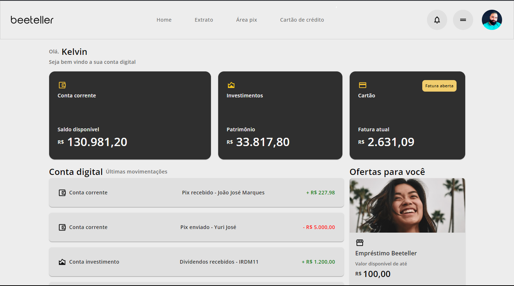

# Beeteller Project

## Sobre o projeto:
O objetivo dessa aplicação foi feita com avaliação técnica da seleção para vaga de desenvolver Front-end. Consite em simular uma aplicação bancaria, onde é visuzaliado extratos, investimentos, movimentaçãoes dentre outros.

#### 
- Projeto Finalizado 🟢 

- React
- Vite
- Typescript
- Vite
- CSS
- Styled components
- Material UI
- Axios
- Jest
- React Testing library
- Mock Service Worker

## Para rodar o projeto local
  - Abra o terminal
  - Clone o repositório para um sua maquina usando Git clone https://github.com/kelvinteixeira/Beeteller-project.git em um local de preferência na sua maquina. 
  - Acesse a pasta que foi criada contendo o repositório
  - Instale as dependências usando o comando yarn ou nom install
  - Rode a aplicação usando comando yarn dev

#### 
Aplicação desenvolvida por mim. Gostou? tem alguma sugestão de melhoria? por favor, entre em contato e ja me adiciona. :D

 
  
  
   
  

